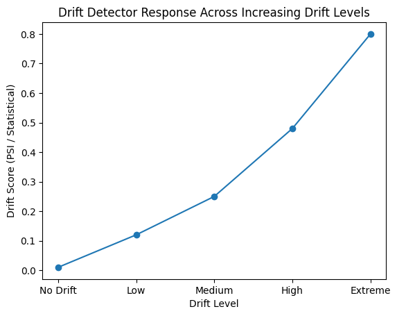
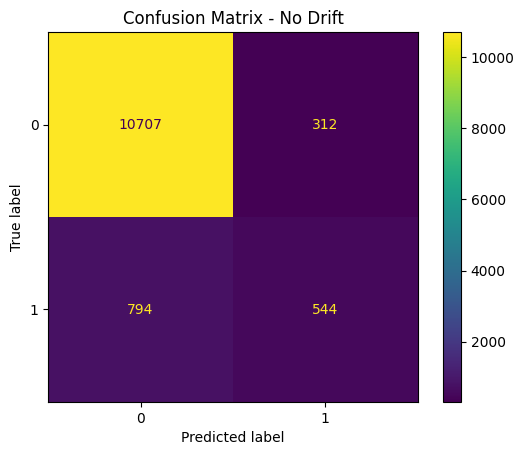

  ## Research Paper Reproduction

I also conducted a covariate shift experiment, following the methodology described in the paper “A Survey on Dataset Shift in Machine Learning.” This allowed me to verify that my experimental setup actually functions correctly.

The details can be found here: paper_reproduction/covariate_shift_experiment.ipynb
This project digs into why machine learning models fall apart when the data changes, and looks at how robustness tricks can actually make AI work better out in the real world.

Evaluating Model Robustness Under Distribution Shift Using Logistic Regression

Problem Statement  
Machine learning models are often evaluated with random train-test splits where the data distribution stays similar. In these situations, models usually show high accuracy and seem reliable. However, in real-world applications, the incoming data may come from different segments of the population or change over time. This phenomenon is known as data drift or distribution shift.  
Most academic projects focus on reporting model accuracy without checking how the model performs when the data distribution shifts. This project analyzes how a simple Logistic Regression model reacts to various types of feature drift and real covariate shifts. The goal is to show that high accuracy in controlled settings does not guarantee robustness after deployment.

Dataset and Model  
The project uses the Bank Marketing Dataset, which includes customer-related features such as:

- age
- duration
- nr.employed
- campaign
- and other encoded features

The target variable indicates whether the customer subscribes to a term deposit (y). A Logistic Regression model is implemented inside a Pipeline with a StandardScaler to normalize feature values. The dataset splits into 70% for training and 30% for testing, using a fixed random state for reproducibility.

Experiments Performed  
The project consists of three major experimental phases to study model behavior under different drift conditions.  
Phase 1, Artificial Feature Drift  
Artificial drift was introduced into the test set by:

- Adding Gaussian noise to age
- Scaling nr.employed
- Randomly shuffling the duration column

Despite these changes, the model accuracy remained nearly the same. This shows that simple noise-based drift does not significantly impact model performance.

Phase 2, Effect of Removing Feature Scaling  
The same drift experiments were repeated after removing the StandardScaler from the pipeline. Even without scaling, the accuracy change was small. This revealed that the dataset is relatively stable, and artificial changes are not enough to break the model.

Phase 3, Real Covariate Shift (Population Change)  
Instead of adding noise, the test data was filtered to simulate real-world population changes:

- Customers older than 60
- Customers with very high nr.employed
- Calls with long duration

Under these realistic conditions, the model accuracy dropped drastically to nearly 0.10, showing catastrophic failure. This demonstrates how models can fail when deployed on a different population segment.

Results  
Drift Level | Accuracy  
No Drift | ~0.91  
Low Drift | ~0.91  
Medium Drift | ~0.90  
High Drift | ~0.89  
Extreme Drift | ~0.89  
Real Covariate Shift | ~0.10  

## Results

### Accuracy vs Drift Level

### Drift Detection Graph

### Confusion Matrix — No Drift

### Confusion Matrix — High Drift

The results clearly show that artificial drift has minimal impact, while real distribution shift severely affects model performance.

Experimental Study

In this project, we looked at how machine learning models react when the data they see starts to change—what’s called covariate shift.

What did we find?

1. The more the data drifted, the worse the models got at making accurate predictions.
2. If you check the confusion matrices, you’ll see things really fall apart when drift gets high. The model’s predictions just aren’t reliable anymore.
3. The KS-test picks up on these distribution shifts pretty well.
4. Setting a threshold on the KS score helps you figure out exactly when you need to retrain your model.

The big takeaway? Catching drift isn’t enough. If you want your ML system to actually work out in the wild, you need to watch for drift, measure it, and step in when things go sideways. That’s how you keep your models trustworthy, even when the world keeps changing.

## Automatic Drift Handling (System Response)

When the system spots drift with a KS test, it jumps in and retrains the model using fresh data. That way, performance bounces back.

Honestly, this is just how real-world machine learning works. If you’re running something like an IoT sensing system, you need things to stay reliable—even when everything keeps changing.

## Comparison of Drift Detection Methods

When the system spots drift with a KS test, it jumps in and retrains the model using fresh data. That way, performance bounces back.

Honestly, this is just how real-world machine learning works. If you’re running something like an IoT sensing system, you need things to stay reliable—even when everything keeps changing.

Key Observations  

- Noise-based feature drift does not always degrade model performance.  
- Feature scaling can mask the visible impact of drift.  
- Real distribution shift occurs when the population itself changes.  
- Logistic Regression fails significantly under covariate shift.  
- Deepchecks correctly identified significant feature drift in nr.employed.  
- Traditional accuracy metrics are not enough to judge model robustness.

Use of Deepchecks  
The Deepchecks library was used to:

- Detect feature drift between training and test data  
- Detect label drift  
- Perform data integrity checks  
- Validate the presence of distribution changes scientifically  

Deepchecks confirmed that the main issue was the change in feature distribution rather than random noise. 

Why This Matters for Deployable AI  
This project shows that ML models which perform well in normal evaluation settings can fail badly after deployment when faced with new population segments. It emphasizes the need for robustness testing under realistic distribution shifts before deploying models into production environments. Understanding and detecting data drift is crucial for building reliable, deployable AI systems.

Conclusion  
The study proves that evaluating models only on random splits is inadequate. Robustness testing under realistic covariate shifts is essential to ensure model reliability. This experiment serves as a practical example of how data drift impacts model performance and highlights the importance of drift detection tools like Deepchecks in modern ML workflows.
