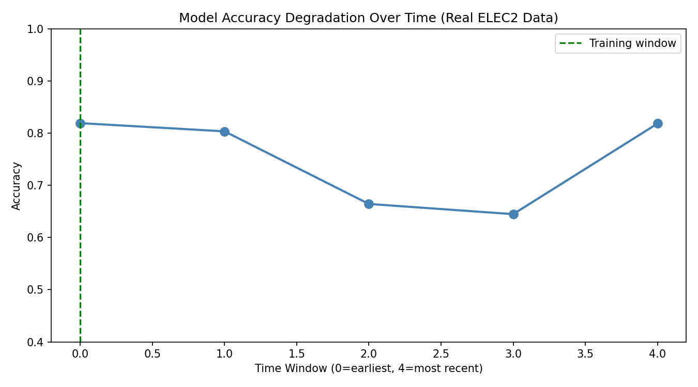
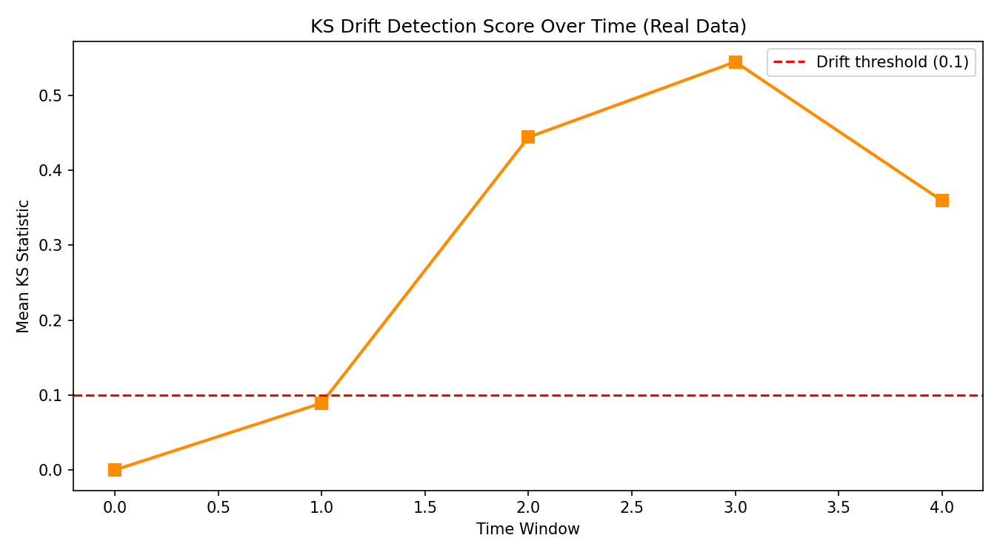
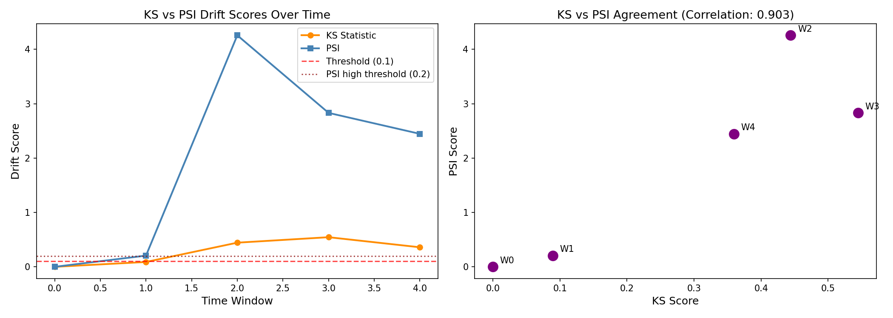
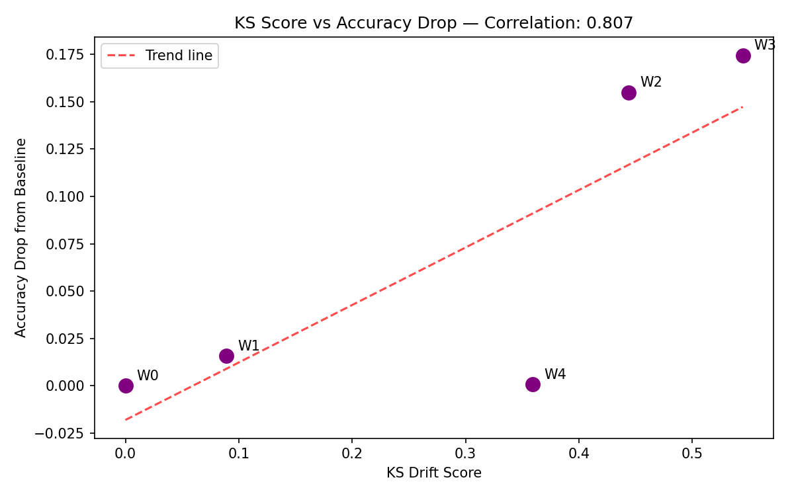
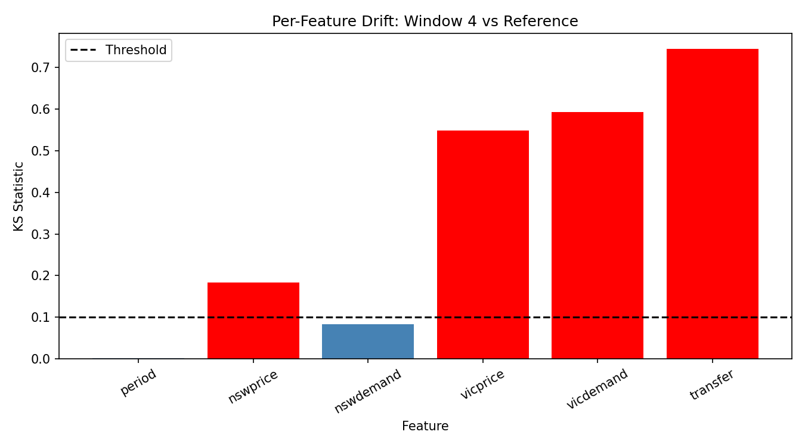
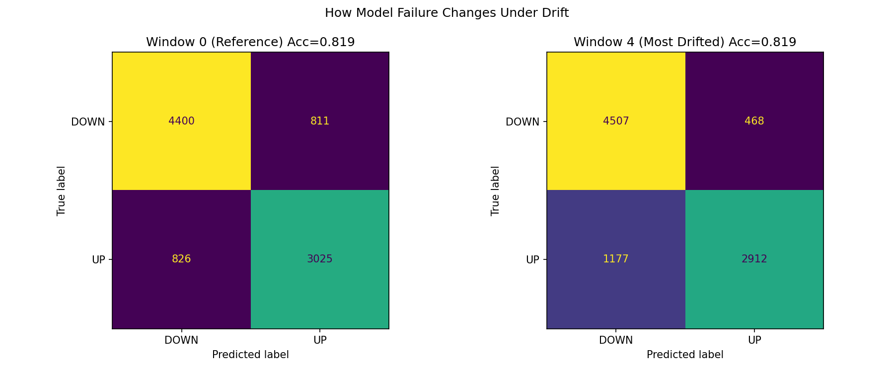

# ELEC2 Drift Study — KS vs PSI Detection on Real Temporal Drift

## What This Study Is About

Most drift detection work tests on artificially perturbed data. This study uses the ELEC2 electricity dataset — a real-world benchmark with known temporal distribution shift — to ask two honest questions:

1. Does the KS statistic reliably predict model accuracy degradation in practice?
2. Does PSI agree with KS, and when does it not?

## Dataset

The ELEC2 dataset records electricity pricing in New South Wales, Australia. The target is whether the price went UP or DOWN relative to the previous 24-hour average. It contains 45,312 samples collected over two years. The distribution changes naturally over time due to market conditions — no artificial perturbation needed.

## Methodology

The dataset was split into five equal time windows in chronological order. A Logistic Regression model was trained exclusively on Window 0 (the earliest period) and tested on all five windows without retraining. This mirrors real deployment conditions where a model trained on historical data must serve predictions as the world changes.

For each window, two drift detectors were computed against the reference window — the KS statistic and the Population Stability Index (PSI). Their scores, flags, and agreement were compared against actual accuracy degradation.

## Key Results

| Window | Accuracy | KS Score | PSI Score | KS Flag | PSI Flag | Agreement |
|--------|----------|----------|-----------|---------|----------|-----------|
| 0 (Reference) | 0.820 | 0.000 | 0.000 | NO DRIFT | NO DRIFT | ✓ |
| 1 | 0.805 | 0.089 | 0.206 | NO DRIFT | DRIFT | ✗ DISAGREE |
| 2 | 0.665 | 0.444 | 4.257 | DRIFT | DRIFT | ✓ |
| 3 | 0.645 | 0.545 | 2.831 | DRIFT | DRIFT | ✓ |
| 4 | 0.820 | 0.359 | 2.445 | DRIFT | DRIFT | ✓ |

**KS-Accuracy correlation: r = 0.807**

## Main Findings

**Finding 1 — PSI detected early drift that KS missed.**
At Window 1, KS scored 0.089 — just below the 0.1 detection threshold — and flagged no drift. PSI scored 0.206, well above its 0.1 threshold, and correctly flagged drift. Accuracy had already dropped from 0.820 to 0.805. PSI was right. KS missed it. This suggests KS is less sensitive to early low-level drift than PSI on this dataset.

**Finding 2 — KS cannot distinguish persistent drift from temporary shift.**
At Window 4, both detectors flagged drift (KS=0.359, PSI=2.445) yet model accuracy fully recovered to baseline 0.820. Neither detector could identify that this shift was transient. This would trigger unnecessary retraining in a production system.

**Finding 3 — PSI scores were dramatically larger than expected.**
PSI values of 4.25 and 2.83 at Windows 2 and 3 are approximately 20 times above the "significant shift" threshold of 0.2. This suggests the electricity market distribution changed far more severely than standard PSI thresholds are calibrated for, raising questions about whether industry-standard thresholds generalise across domains.

## Graphs

**Accuracy Degradation Over Time**

**KS Drift Detection Score Over Time**

**KS vs PSI Comparison**

**KS Score vs Accuracy Drop**

**Per Feature Drift Breakdown**

**Confusion Matrices Before and After Drift**

## Limitations and Next Steps

This study uses only Logistic Regression and two detection methods. Future work should test across multiple model types, compare KS and PSI against MMD, and examine whether combining drift magnitude with drift persistence duration reduces false alarms in cyclical systems. The question of whether PSI thresholds need domain-specific calibration is a natural next research question.

## Author

Mrinank — BS Data Science, IIT Madras (2nd Year)  
Independent research alongside coursework.  
GitHub: https://github.com/MrinankKumar/ml-data-drift-reliability
